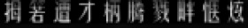

English [README](./README_en.md) (`out-dated`).

# cnocr

**cnocr** 是 **Python 3** 下的**文字识别**（**Optical Character Recognition**，简称**OCR**）工具包，支持**中文**、**英文**的常见字符识别，自带了多个训练好的识别模型，安装后即可直接使用。欢迎扫码加入微信交流群：


作者也维护 **知识星球** [**CnOCR/CnSTD私享群**](https://t.zsxq.com/FEYZRJQ) ，欢迎加入。**知识星球私享群**会陆续发布一些CnOCR/CnSTD相关的私有资料，包括**更详细的训练教程**，**未公开的模型**，使用过程中遇到的难题解答等。本群也会发布OCR/STD相关的最新研究资料。此外，**私享群中作者每月提供两次免费特有数据的训练服务**。

## 详细文档

见 [CnOcr在线文档](https://cnocr.readthedocs.io/) 。

## 使用场景说明

**cnocr** 主要针对的是**排版简单的印刷体文字图片**，如截图图片，扫描件等。目前内置的文字检测和分行模块无法处理复杂的文字排版定位。如果要用于场景文字图片的识别，需要结合其他的场景文字检测引擎使用，例如文字检测引擎 **[cnstd](https://github.com/breezedeus/cnstd)** 。

## 示例

| 图片                                                                                | OCR结果                                                                                                                                                                                                                                                                                                                                                                     |
| --------------------------------------------------------------------------------- | ------------------------------------------------------------------------------------------------------------------------------------------------------------------------------------------------------------------------------------------------------------------------------------------------------------------------------------------------------------------------- |
|                    | Hello world!你好世界                                                                                                                                                                                                                                                                                                                                                          |
|                | 铑泡胭释邑疫反隽寥缔                                                                                                                                                                                                                                                                                                                                                                |
|                | 拇箬遭才柄腾戮胖惬炫                                                                                                                                                                                                                                                                                                                                                                |
|                | 寿猿嗅髓孢刀谎弓供捣                                                                                                                                                                                                                                                                                                                                                                |
|                | 马靼蘑熨距额猬要藕萼                                                                                                                                                                                                                                                                                                                                                                |
|                | 掉江悟厉励.谌查门蠕坑                                                                                                                                                                                                                                                                                                                                                               |
|                        | nd-chips fructed ast                                                                                                                                                                                                                                                                                                                                                      |
|                        | zouna unpayably Raqu                                                                                                                                                                                                                                                                                                                                                      |
|                        | ape fissioning Senat                                                                                                                                                                                                                                                                                                                                                      |
|                        | ling oughtlins near                                                                                                                                                                                                                                                                                                                                                       |
|            | 网络支付并无本质的区别，因为<br />每一个手机号码和邮件地址背后<br />都会对应着一个账户--这个账<br />户可以是信用卡账户、借记卡账<br />户，也包括邮局汇款、手机代<br />收、电话代收、预付费卡和点卡<br />等多种形式。                                                                                                                                                                                                                                             |
|            | 当然，在媒介越来越多的情形下,<br />意味着传播方式的变化。过去主流<br />的是大众传播,现在互动性和定制<br />性带来了新的挑战——如何让品牌<br />与消费者更加互动。                                                                                                                                                                                                                                                                             |
|  | This chapter is currently only available in this web version. ebook and print will follow.<br />Convolutional neural networks learn abstract features and concepts from raw image pixels. Feature<br />Visualization visualizes the learned features by activation maximization. Network Dissection labels<br />neural network units (e.g. channels) with human concepts. |
|  | transforms the image many times. First, the image goes through many convolutional layers. In those<br />convolutional layers, the network learns new and increasingly complex features in its layers. Then the <br />transformed image information goes through the fully connected layers and turns into a classification<br />or prediction.                            |

## 安装

嗯，安装真的很简单。

```bash
pip install cnocr
```

安装速度慢的话，可以指定国内的安装源，如使用豆瓣源：

```bash
pip install cnocr -i https://pypi.doubanio.com/simple
```

> 注意：请使用 **Python3**（3.6以及之后版本应该都行），没测过Python2下是否ok。

## 未来工作

* [x] 支持图片包含多行文字 (`Done`)
* [x] crnn模型支持可变长预测，提升灵活性 (since `V1.0.0`)
* [x] 完善测试用例 (`Doing`)
* [x] 修bugs（目前代码还比较凌乱。。） (`Doing`)
* [x] 支持`空格`识别（since `V1.1.0`）
* [x] 尝试新模型，如 DenseNet，进一步提升识别准确率（since `V1.1.0`）
* [x] 优化训练集，去掉不合理的样本；在此基础上，重新训练各个模型
* [x] 由 MXNet 改为 PyTorch 架构（since `V2.0.0`）
* [x] 基于 PyTorch 训练更高效的模型
* [ ] 支持列格式的文字识别
