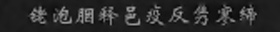
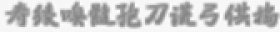
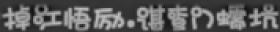
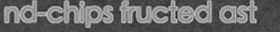
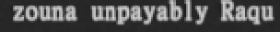
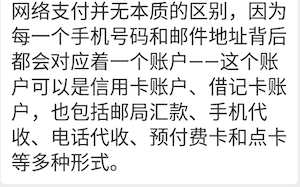
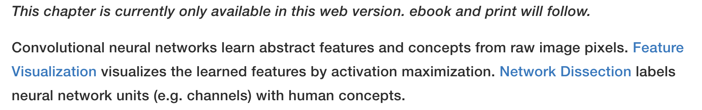
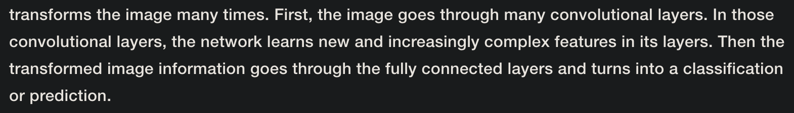
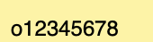
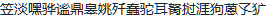

# Release Notes

### Update 2020.04.21: 发布 cnocr V1.1.0

V1.1.0对代码做了很大改动，重写了大部分训练的代码，也生成了更多更难的训练和测试数据。训练好的模型相较于之前版本的模型精度有显著提升，尤其是针对英文单词的识别。


以下列出了主要的变更：

* 更新了训练代码，使用mxnet的`recordio`首先把数据转换成二进制格式，提升后续的训练效率。训练时支持对图片做实时数据增强。也加入了更多可传入的参数。

* **允许训练集中的文字数量不同，目前是中文10个字，英文20个字母。**

* 提供了更多的模型选择，允许大家按需训练多种不同大小的识别模型。

* 内置了各种训练好的模型，最小的模型只有之前模型的`1/5`大小。所有模型都可免费使用。

* 相较于之前版本的模型，新的模型精度有显著提升，尤其是针对英文单词的识别。**新模型已经可以识别英文单词间的空格。**

* **支持文字识别只在给定字符集中进行。** 对于一些纯数字或者纯英文字母的应用场景可以带来识别率提升。

* 优化了对黑底白字多行文字图片的支持。

* mxnet依赖升级到更新的版本了。很多人反馈mxnet `1.4.1`经常找不到没法装，现在升级到`>=1.5.0,<1.7.0`。

  

### Update 2019.07.25: 发布 cnocr V1.0.0

`cnocr`发布了预测效率更高的新版本v1.0.0。**新版本的模型跟以前版本的模型不兼容**。所以如果大家是升级的话，需要重新下载最新的模型文件。具体说明见下面（流程和原来相同）。


主要改动如下：

-  **crnn模型支持可变长预测，提升预测效率**
-  支持利用特定数据对现有模型进行精调（继续训练）
-  修复bugs，如训练时`accuracy`一直为`0`
-  依赖的 `mxnet` 版本从`1.3.1`更新至 `1.4.1`

# cnocr

**cnocr**是用来做中文OCR的**Python 3**包。cnocr自带了训练好的识别模型，安装后即可直接使用。


cnocr主要针对的是排版简单的印刷体文字图片，如截图图片，扫描件等。cnocr目前内置的文字检测和分行模块无法处理复杂的文字排版定位。如果要用于场景文字图片的识别，需要结合其他的场景文字检测引擎使用。


本项目起源于我们自己 ([爱因互动 Ein+](https://einplus.cn)) 内部的项目需求，所以非常感谢公司的支持。


## 示例

| 图片                                                         | OCR结果                                                      |
| ------------------------------------------------------------ | ------------------------------------------------------------ |
|         | Hello World!你好世界                                         |
|     | 铑泡胭释邑疫反隽寥缔                                         |
|     | 拇箬遭才柄腾戮胖惬炫                                         |
|     | 寿猿嗅髓孢刀谎弓供捣                                         |
|     | 马靼蘑熨距额猬要藕萼                                         |
|     | 掉江悟厉励.谌查门蠕坑                                        |
|             | nd-chips fructed ast                                         |
|         | zouna unpayably Raqu                                         |
|         | ape fissioning Senat                                         |
|         | ling oughtlins near                                         |
|  | 网络支付并无本质的区别，因为<br />每一个手机号码和邮件地址背后<br />都会对应着一个账户--这个账<br />户可以是信用卡账户、借记卡账<br />户，也包括邮局汇款、手机代<br />收、电话代收、预付费卡和点卡<br />等多种形式。 |
|  | 当然，在媒介越来越多的情形下,<br />意味着传播方式的变化。过去主流<br />的是大众传播,现在互动性和定制<br />性带来了新的挑战——如何让品牌<br />与消费者更加互动。 |
|  | This chapter is currently only available in this web version. ebook and print will follow.<br />Convolutional neural networks learn abstract features and concepts from raw image pixels. Feature<br />Visualization visualizes the learned features by activation maximization. Network Dissection labels<br />neural network units (e.g. channels) with human concepts. |
|  | transforms the image many times. First, the image goes through many convolutional layers. In those<br />convolutional layers, the network learns new and increasingly complex features in its layers. Then the <br />transformed image information goes through the fully connected layers and turns into a classification<br />or prediction. |


## 安装

嗯，安装真的很简单。

```bash
pip install cnocr
```

> 注意：请使用Python3 (3.4, 3.5, 3.6以及之后版本应该都行)，没测过Python2下是否ok。


## 可直接使用的模型

cnocr的ocr模型可以分为两阶段：第一阶段是获得ocr图片的局部编码向量，第二部分是对局部编码向量进行序列学习，获得序列编码向量。目前两个阶段分别包含以下的模型：

1. 局部编码模型（emb model）
   * `conv`：多层的卷积网络；
   * `conv-lite`：更小的多层卷积网络；
   * `densenet`：一个小型的`densenet`网络；
   * `densenet-lite`：一个更小的`densenet`网络。
2. 序列编码模型（seq model）
   * `lstm`：两层的LSTM网络；
   * `gru`：两层的GRU网络；
   * `fc`：两层的全连接网络。


cnocr目前包含以下可直接使用的模型，训练好的模型都放在 **[cnocr-models](https://github.com/breezedeus/cnocr-models)** 项目中，可免费下载使用：

| 模型名称 | 局部编码模型 | 序列编码模型 | 模型大小 | 迭代次数 | 测试集准确率 | 测试集中的图片预测速度<br />（秒/张） |
| :------- | ------------ | ------------ | -------- | ------ | -------- | ------ |
| conv-lstm | conv | lstm | 36M | 50 | 98.5% | 0.015924 |
| conv-lite-lstm | conv-lite | lstm | 23M | 45 | 98.6% | 0.033749 |
| conv-lite-fc | conv-lite | fc | 20M | 27 | 98.6% | 0.033837 |
| densenet-lite-lstm | densenet-lite | lstm | 8.6M | 42 | 98.6% | 0.013124 |
| densenet-lite-fc | densenet-lite | fc | 6.8M | 32 | 97% | 0.012652 |

> 模型名称是由局部编码模型和序列编码模型名称拼接而成。

> 图片预测速度是在多核CPU机器上做的测试， 绝对值依赖机器资源，意义不大；但不同模型之间的相对值是可以参考的。


虽然上表中给出的多个模型在测试集上的准确率都是 `98.6%`，但从实际使用经验看，综合中英文的识别效果，`conv-lite-fc`是效果最好的，其次是 `densenet-lite-lstm` 和 `conv-lite-lstm`。对于中文识别且识别困难（如文字比较模糊）的场景，建议尝试模型 `conv-lite-lstm`。对于简单的中文识别场景，可以使用模型  `densenet-lite-lstm`  或 `densenet-lite-fc` ，或者利用自己的训练数据对它们进行精调。


模型 `conv-lstm`把图片长度压缩到 `1/8`再做预测，其他模型是压缩到`1/4`再做预测，所以 `conv-lstm` 虽然比 `conv-lite-lstm` 有更多参数，但预测速度却快了一倍。


## 特色

本项目的初期代码fork自 [crnn-mxnet-chinese-text-recognition](https://github.com/diaomin/crnn-mxnet-chinese-text-recognition)，感谢作者。

但源项目使用起来不够方便，所以我在此基础上做了一些封装和重构。主要变化如下：

* 不再使用需要额外安装的MXNet WarpCTC Loss，改用原生的 MXNet CTC Loss。所以安装极简！

* 自带训练好的中文OCR识别模型。不再需要额外训练！

* 增加了预测（或推断）接口。所以使用方便！

  

## 使用方法

首次使用cnocr时，系统会自动从 **[cnocr-models](https://github.com/breezedeus/cnocr-models)** 下载zip格式的模型压缩文件，并存于 `~/.cnocr`目录。
下载后的zip文件代码会自动对其解压，然后把解压后的模型相关目录放于`~/.cnocr/1.1.0`目录中。

如果系统不能自动从 **[cnocr-models](https://github.com/breezedeus/cnocr-models)** 成功下载zip文件，则需要手动下载此zip文件并把它放于 `~/.cnocr/1.1.0`目录。如果Github下载太慢，也可以从 [百度云盘](链接: https://pan.baidu.com/s/1j9PASisDxB_5tjrV2fs2-g)下载， 提取码为 `ri27`。

放置好zip文件后，后面的事代码就会自动执行了。


### 代码预测

类`CnOcr`是OCR的主类，包含了三个函数针对不同场景进行文字识别。类`CnOcr`的初始化函数如下：

```python
class CnOcr(object):
    def __init__(
        self,
        model_name='conv-lite-fc',
        model_epoch=None,
        cand_alphabet=None,
        root=data_dir(),
    ):
```

其中的几个参数含义如下：

* `model_name`: 模型名称，即上面表格第一列中的值。默认为 `conv-lite-fc`。
* `model_epoch`: 模型迭代次数。默认为 `None`，表示使用默认的迭代次数值。对于模型名称 `conv-lite-fc`就是 `27`。
* `cand_alphabet`: 待识别字符所在的候选集合。默认为 `None`，表示不限定识别字符范围。`cnocr.consts`中内置了两个候选集合：(1)数字和标点 `NUMBERS`；(1)英文字母、数字和标点 `ENG_LETTERS`。
   * 例如对于图片  ，不做约束时识别结果为 `o12345678`；如果加入数字约束时（`ocr = CnOcr(cand_alphabet=NUMBERS)`），识别结果为 `012345678`。
* `root`: 模型文件所在的根目录。
   * Linux/Mac下默认值为 `~/.cnocr`，表示模型文件所处文件夹类似 `~/.cnocr/1.1.0/conv-lite-fc`。
   * Windows下默认值为 `C:\Users\<username>\AppData\Roaming\cnocr`。


每个参数都有默认取值，所以可以不传入任何参数值进行初始化：`ocr = CnOcr()`。


类`CnOcr`主要包含三个函数，下面分别说明。


#### 1. 函数`CnOcr.ocr(img_fp)`

函数`CnOcr.ocr(img_fp)`可以对包含多行文字（或单行）的图片进行文字识别。


**函数说明**：

- 输入参数 `img_fp`: 可以是需要识别的图片文件路径（如上例）；或者是已经从图片文件中读入的数组，类型可以为`mx.nd.NDArray` 或  `np.ndarray`，取值应该是`[0，255]`的整数，维数应该是`(height, width, 3)`，第三个维度是channel，它应该是`RGB`格式的。
- 返回值：为一个嵌套的`list`，类似这样`[['第', '一', '行'], ['第', '二', '行'], ['第', '三', '行']]`。


**调用示例**：


```python
from cnocr import CnOcr
ocr = CnOcr()
res = ocr.ocr('examples/multi-line_cn1.png')
print("Predicted Chars:", res)
```

或：
```python
import mxnet as mx
from cnocr import CnOcr
ocr = CnOcr()
img_fp = 'examples/multi-line_cn1.png'
img = mx.image.imread(img_fp, 1)
res = ocr.ocr(img)
print("Predicted Chars:", res)
```


上面使用的图片文件 [examples/multi-line_cn1.png](./examples/multi-line_cn1.png)内容如下：


上面预测代码段的返回结果如下：

```bash
Predicted Chars: [['网', '络', '支', '付', '并', '无', '本', '质', '的', '区', '别', '，', '因', '为'],
                  ['每', '一', '个', '手', '机', '号', '码', '和', '邮', '件', '地', '址', '背', '后'],
                  ['都', '会', '对', '应', '着', '一', '个', '账', '户', '一', '―', '这', '个', '账'],
                  ['户', '可', '以', '是', '信', '用', '卡', '账', '户', '、', '借', '记', '卡', '账'],
                  ['户', '，', '也', '包', '括', '邮', '局', '汇', '款', '、', '手', '机', '代'],
                  ['收', '、', '电', '话', '代', '收', '、', '预', '付', '费', '卡', '和', '点', '卡'],
                  ['等', '多', '种', '形', '式', '。']]
```


#### 2. 函数`CnOcr.ocr_for_single_line(img_fp)`

如果明确知道要预测的图片中只包含了单行文字，可以使用函数`CnOcr.ocr_for_single_line(img_fp)`进行识别。和 `CnOcr.ocr()`相比，`CnOcr.ocr_for_single_line()`结果可靠性更强，因为它不需要做额外的分行处理。

**函数说明**：

- 输入参数 `img_fp`: 可以是需要识别的单行文字图片文件路径（如上例）；或者是已经从图片文件中读入的数组，类型可以为`mx.nd.NDArray` 或  `np.ndarray`，取值应该是`[0，255]`的整数，维数应该是`(height, width)`或`(height, width, channel)`。如果没有channel，表示传入的就是灰度图片。第三个维度channel可以是`1`（灰度图片）或者`3`（彩色图片）。如果是彩色图片，它应该是`RGB`格式的。
- 返回值：为一个`list`，类似这样`['你', '好']`。


**调用示例**：

```python
from cnocr import CnOcr
ocr = CnOcr()
res = ocr.ocr_for_single_line('examples/rand_cn1.png')
print("Predicted Chars:", res)
```

或：

```python
import mxnet as mx
from cnocr import CnOcr
ocr = CnOcr()
img_fp = 'examples/rand_cn1.png'
img = mx.image.imread(img_fp, 1)
res = ocr.ocr_for_single_line(img)
print("Predicted Chars:", res)
```


对图片文件 [examples/rand_cn1.png](./examples/rand_cn1.png)：



的预测结果如下：

```bash
Predicted Chars: ['笠', '淡', '嘿', '骅', '谧', '鼎', '臭', '姚', '歼', '蠢', '驼', '耳', '裔', '挝', '涯', '狗', '蒽', '子', '犷'] 
```


#### 3. 函数`CnOcr.ocr_for_single_lines(img_list)`

函数`CnOcr.ocr_for_single_lines(img_list)`可以**对多个单行文字图片进行批量预测**。函数`CnOcr.ocr(img_fp)`和`CnOcr.ocr_for_single_line(img_fp)`内部其实都是调用的函数`CnOcr.ocr_for_single_lines(img_list)`。


**函数说明**：

- 输入参数` img_list`: 为一个`list`；其中每个元素是已经从图片文件中读入的数组，类型可以为`mx.nd.NDArray` 或  `np.ndarray`，取值应该是`[0，255]`的整数，维数应该是`(height, width)`或`(height, width, channel)`。如果没有channel，表示传入的就是灰度图片。第三个维度channel可以是`1`（灰度图片）或者`3`（彩色图片）。如果是彩色图片，它应该是`RGB`格式的。
- 返回值：为一个嵌套的`list`，类似这样`[['第', '一', '行'], ['第', '二', '行'], ['第', '三', '行']]`。


**调用示例**：

```python
import mxnet as mx
from cnocr import CnOcr
ocr = CnOcr()
img_fp = 'examples/multi-line_cn1.png'
img = mx.image.imread(img_fp, 1).asnumpy()
line_imgs = line_split(img, blank=True)
line_img_list = [line_img for line_img, _ in line_imgs]
res = ocr.ocr_for_single_lines(line_img_list)
print("Predicted Chars:", res)
```


更详细的使用方法，可参考 [tests/test_cnocr.py](./tests/test_cnocr.py) 中提供的测试用例。


### 脚本引用

也可以使用脚本模式预测：

```bash
python scripts/cnocr_predict.py --file examples/multi-line_cn1.png
```

返回结果同上面。


### 训练自己的模型

cnocr自带训练好的模型， 安装后即可直接使用。但如果你需要训练自己的模型，请参考下面的步骤。所有代码均可在文件 [Makefile](./Makefile) 中找到。


#### （一）转换图片数据格式

为了提升训练效率，在开始训练之前，需要使用mxnet的`recordio`首先把数据转换成二进制格式：

```makefile
DATA_ROOT_DIR = data/sample-data
REC_DATA_ROOT_DIR = data/sample-data-lst

# `EMB_MODEL_TYPE` 可取值：['conv', 'conv-lite-rnn', 'densenet', 'densenet-lite']
EMB_MODEL_TYPE = densenet-lite
# `SEQ_MODEL_TYPE` 可取值：['lstm', 'gru', 'fc']
SEQ_MODEL_TYPE = fc
MODEL_NAME = $(EMB_MODEL_TYPE)-$(SEQ_MODEL_TYPE)

# 产生 *.lst 文件
gen-lst:
    python scripts/im2rec.py --list --num-label 20 --chunks 1 \
        --train-idx-fp $(DATA_ROOT_DIR)/train.txt --test-idx-fp $(DATA_ROOT_DIR)/test.txt --prefix $(REC_DATA_ROOT_DIR)/sample-data

# 利用 *.lst 文件产生 *.idx 和 *.rec 文件。
# 真正的图片文件存储在 `examples` 目录，可通过 `--root` 指定。
gen-rec:
    python scripts/im2rec.py --pack-label --color 1 --num-thread 1 --prefix $(REC_DATA_ROOT_DIR) --root examples
```


#### （二）训练模型

利用下面命令在CPU上训练模型：

```makefile
# 训练模型
train:
    python scripts/cnocr_train.py --gpu 0 --emb_model_type $(EMB_MODEL_TYPE) --seq_model_type $(SEQ_MODEL_TYPE) \
        --optimizer adam --epoch 20 --lr 1e-4 \
        --train_file $(REC_DATA_ROOT_DIR)/sample-data_train --test_file $(REC_DATA_ROOT_DIR)/sample-data_test
```

如果需要在GPU上训练，把上面命令中的参数 `--gpu 0`改为`--gpu <num_gpu>`，其中的`<num_gpu>` 为使用的GPU数量。注意，使用GPU训练需要安装mxnet的GPU版本，如`mxnet-cu101`。


#### （三）评估模型

训练好的模型，可以使用脚本 [scripts/cnocr_evaluate.py](scripts/cnocr_evaluate.py) 评估在测试集上的效果：

```makefile
# 在测试集上评估模型，所有badcases的具体信息会存放到文件夹 `evaluate/$(MODEL_NAME)` 中
evaluate:
    python scripts/cnocr_evaluate.py --model-name $(MODEL_NAME) --model-epoch 1 -v -i $(DATA_ROOT_DIR)/test.txt \
        --image-prefix-dir examples --batch-size 128 -o evaluate/$(MODEL_NAME)
```


当然，也可以查看模型在单个文件上的预测效果：

```makefile
predict:
    python scripts/cnocr_predict.py --model_name $(MODEL_NAME) --file examples/rand_cn1.png
```


上面所有代码均可在文件 [Makefile](./Makefile) 中找到。


## 未来工作

* [x] 支持图片包含多行文字 (`Done`)
* [x] crnn模型支持可变长预测，提升灵活性 (since `V1.0.0`)
* [x] 完善测试用例 (`Doing`)
* [x] 修bugs（目前代码还比较凌乱。。） (`Doing`)
* [x] 支持`空格`识别（since `V1.1.0`）
* [x] 尝试新模型，如 DenseNet，进一步提升识别准确率（since `V1.1.0`）
* [ ] 加入场景文本检测功能
* [ ] 优化训练集，去掉不合理的样本；在此基础上，重新训练各个模型

