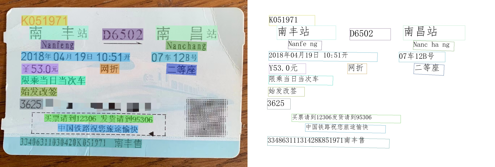
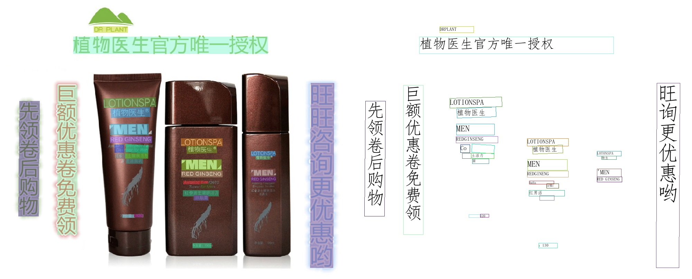
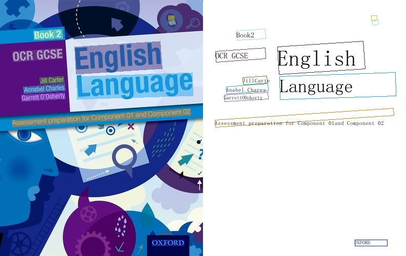
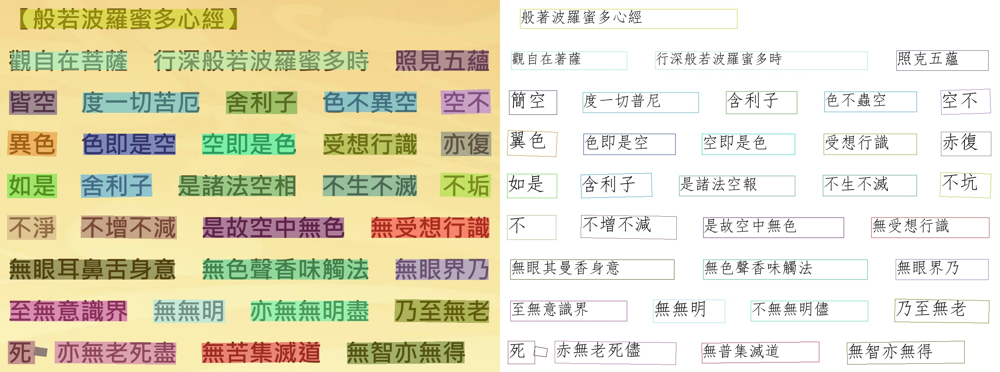
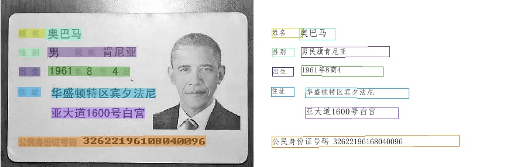
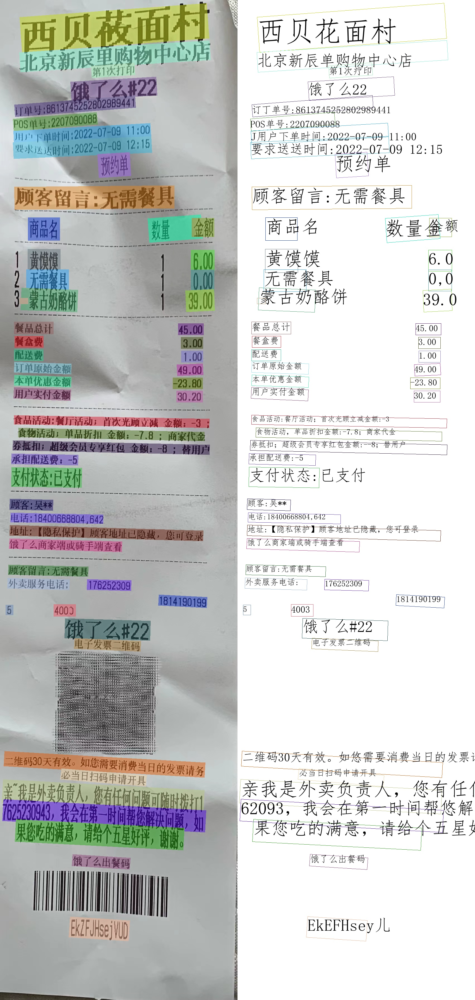

<div align="center">
  
  <div>&nbsp;</div>

[](./LICENSE)
[](https://cnocr.readthedocs.io/zh/latest/?badge=latest)
[](https://badge.fury.io/py/cnocr)
[](https://github.com/breezedeus/cnocr)
[](https://github.com/breezedeus/cnocr)


[](https://twitter.com/breezedeus)

[📖文档](https://cnocr.readthedocs.io/zh/latest/) |
[🛠️安装](https://cnocr.readthedocs.io/zh/latest/install/) |
[🧳自带模型](https://cnocr.readthedocs.io/zh/latest/models/) |
[📟在线Demo](https://share.streamlit.io/breezedeus/cnstd/st-deploy/cnstd/app.py) |
[💬交流群](https://cnocr.readthedocs.io/zh/latest/contact/)

</div>

<div align="center">

[English](./README_en.md) | 简体中文

</div>

# CnOCR

[**CnOCR**](https://github.com/breezedeus/cnocr) 是 **Python 3** 下的**文字识别**（**Optical Character Recognition**，简称**OCR**）工具包，支持**简体中文**、**繁体中文**（部分模型）、**英文**和**数字**的常见字符识别，支持竖排文字的识别。自带了**20+个** [训练好的识别模型](https://cnocr.readthedocs.io/zh/latest/models/)，适用于不同应用场景，安装后即可直接使用。欢迎扫码加入微信交流群：

<div align="center">
  
</div>


作者也维护 **知识星球** [**CnOCR/CnSTD私享群**](https://t.zsxq.com/FEYZRJQ) ，欢迎加入。**知识星球私享群**会陆续发布一些CnOCR/CnSTD相关的私有资料，包括**更详细的训练教程**，**未公开的模型**，使用过程中遇到的难题解答等。本群也会发布OCR/STD相关的最新研究资料。此外，**私享群中作者每月提供两次免费特有数据的训练服务**。

## 详细文档

见 [CnOCR在线文档](https://cnocr.readthedocs.io/) 。

## 使用说明

**CnOCR** 从 **V2.2** 开始，内部自动调用文字检测引擎 **[CnSTD](https://github.com/breezedeus/cnstd)** 进行文字检测和定位。所以 **CnOCR** V2.2 不仅能识别排版简单的印刷体文字图片，如截图图片，扫描件等，也能识别**一般图片中的场景文字**。

以下是一些不同场景的调用示例。

## 不同场景的调用示例

### 常见的图片识别

所有参数都使用默认值即可。如果发现效果不够好，多调整下各个参数看效果，最终往往能获得比较理想的精度。

```python
from cnocr import CnOcr

img_fp = './docs/examples/huochepiao.jpeg'
ocr = CnOcr()  # 所有参数都使用默认值
out = ocr.ocr(img_fp)

print(out)
```

识别结果：

<div align="center">
  
</div>


### 排版简单的印刷体截图图片识别

针对 **排版简单的印刷体文字图片**，如截图图片，扫描件图片等，可使用 `det_model_name='naive_det'`，相当于不使用文本检测模型，而使用简单的规则进行分行。

使用 `det_model_name='naive_det'` 的最大优势是**速度快**，劣势是对图片比较挑剔。如何判断是否该使用此检测模型呢？最简单的方式就是拿应用图片试试效果，效果好就用，不好就不用。

```python
from cnocr import CnOcr

img_fp = './docs/examples/multi-line_cn1.png'
ocr = CnOcr(det_model_name='naive_det') 
out = ocr.ocr(img_fp)

print(out)
```
<div align="center">

| 图片                                                                      | OCR结果                                                                                                                         |
| ----------------------------------------------------------------------- | ----------------------------------------------------------------------------------------------------------------------------- |
|  | 网络支付并无本质的区别，因为<br />每一个手机号码和邮件地址背后<br />都会对应着一个账户--这个账<br />户可以是信用卡账户、借记卡账<br />户，也包括邮局汇款、手机代<br />收、电话代收、预付费卡和点卡<br />等多种形式。 |

</div>


### 竖排文字识别

采用来自 [**PaddleOCR**](https://github.com/PaddlePaddle/PaddleOCR)（之后简称 **ppocr**）的中文识别模型 `rec_model_name='ch_PP-OCRv3'` 进行识别。

```python
from cnocr import CnOcr

img_fp = './docs/examples/shupai.png'
ocr = CnOcr(rec_model_name='ch_PP-OCRv3')
out = ocr.ocr(img_fp)

print(out)
```

识别结果：
<div align="center">
  
</div>


### 英文识别

虽然中文检测和识别模型也能识别英文，但**专为英文文字训练的检测器和识别器往往精度更高**。如果是纯英文的应用场景，建议使用来自 **ppocr** 的英文检测模型 `det_model_name='en_PP-OCRv3_det'`， 和英文识别模型 `rec_model_name='en_PP-OCRv3'` 。

```python
from cnocr import CnOcr

img_fp = './docs/examples/en_book1.jpeg'
ocr = CnOcr(det_model_name='en_PP-OCRv3_det', rec_model_name='en_PP-OCRv3')
out = ocr.ocr(img_fp)

print(out)
```

识别结果：

<div align="center">
  
</div>


### 繁体中文识别

采用来自ppocr的繁体识别模型 `rec_model_name='chinese_cht_PP-OCRv3'` 进行识别。

```python
from cnocr import CnOcr

img_fp = './docs/examples/fanti.jpg'
ocr = CnOcr(rec_model_name='chinese_cht_PP-OCRv3')  # 识别模型使用繁体识别模型
out = ocr.ocr(img_fp)

print(out)
```

使用此模型时请注意以下问题：

* 识别精度一般，不是很好；

* 除了繁体字，对标点、英文、数字的识别都不好；

* 此模型不支持竖排文字的识别。

识别结果：
<div align="center">
  
</div>


### 单行文字的图片识别

如果明确知道待识别的图片是单行文字图片（如下图），可以使用类函数 `CnOcr.ocr_for_single_line()` 进行识别。这样就省掉了文字检测的时间，速度会快一倍以上。

<div align="center">
  
</div>
调用代码如下：

```python
from cnocr import CnOcr

img_fp = './docs/examples/helloworld.jpg'
ocr = CnOcr()
out = ocr.ocr_for_single_line(img_fp)
print(out)
```


### 更多应用示例

* **核酸疫苗截图识别**
<div align="center">
  
</div>

* **身份证识别**
<div align="center">
  
</div>

* **饭店小票识别**
<div align="center">
  
</div>
  

  

## 安装

嗯，顺利的话一行命令即可。

```bash
pip install cnocr
```

安装速度慢的话，可以指定国内的安装源，如使用豆瓣源：

```bash
pip install cnocr -i https://pypi.doubanio.com/simple
```

> **Note** 
>
> 请使用 **Python3**（3.6以及之后版本应该都行），没测过Python2下是否ok。

更多说明可见 [安装文档](https://cnocr.readthedocs.io/zh/latest/install/)。

> **Warning** 
>
> 如果电脑中从未安装过 `PyTorch`，`OpenCV` python包，初次安装可能会遇到问题，但一般都是常见问题，可以自行百度/Google解决。


## 可使用的模型

### 可使用的检测模型

| `det_model_name`                                             | PyTorch 版本 | ONNX 版本 | 模型原始来源 | 模型文件大小 | 支持语言                       | 是否支持竖排文字识别 |
| ------------------------------------------------------------ | ------------ | --------- | ------------ | ------------ | ------------------------------ | -------------------- |
| db_shufflenet_v2                                             | √            | X         | cnocr        | 18 M         | 简体中文、繁体中文、英文、数字 | √                    |
| **db_shufflenet_v2_small**                                   | √            | X         | cnocr        | 12 M         | 简体中文、繁体中文、英文、数字 | √                    |
| [db_shufflenet_v2_tiny](https://mp.weixin.qq.com/s/fHPNoGyo72EFApVhEgR6Nw) | √            | X         | cnocr        | 7.5 M        | 简体中文、繁体中文、英文、数字 | √                    |
| db_mobilenet_v3                                              | √            | X         | cnocr        | 16 M         | 简体中文、繁体中文、英文、数字 | √                    |
| db_mobilenet_v3_small                                        | √            | X         | cnocr        | 7.9 M        | 简体中文、繁体中文、英文、数字 | √                    |
| db_resnet34                                                  | √            | X         | cnocr        | 86 M         | 简体中文、繁体中文、英文、数字 | √                    |
| db_resnet18                                                  | √            | X         | cnocr        | 47 M         | 简体中文、繁体中文、英文、数字 | √                    |
| ch_PP-OCRv3_det                                              | X            | √         | ppocr        | 2.3 M        | 简体中文、繁体中文、英文、数字 | √                    |
| ch_PP-OCRv2_det                                              | X            | √         | ppocr        | 2.2 M        | 简体中文、繁体中文、英文、数字 | √                    |
| **en_PP-OCRv3_det**                                          | X            | √         | ppocr        | 2.3 M        | **英文**、数字                 | √                    |


### 可使用的识别模型

| `rec_model_name`          | PyTorch 版本 | ONNX 版本 | 模型原始来源 | 模型文件大小 | 支持语言                 | 是否支持竖排文字识别 |
| ------------------------- | ------------ | --------- | ------------ | ------------ | ------------------------ | -------------------- |
| densenet_lite_114-fc      | √            | √         | cnocr        | 4.9 M        | 简体中文、英文、数字     | X                    |
| densenet_lite_124-fc      | √            | √         | cnocr        | 5.1 M        | 简体中文、英文、数字     | X                    |
| densenet_lite_134-fc      | √            | √         | cnocr        | 5.4 M        | 简体中文、英文、数字     | X                    |
| densenet_lite_136-fc      | √            | √         | cnocr        | 5.9 M        | 简体中文、英文、数字     | X                    |
| densenet_lite_134-gru     | √            | X         | cnocr        | 11 M         | 简体中文、英文、数字     | X                    |
| densenet_lite_136-gru     | √            | X         | cnocr        | 12 M         | 简体中文、英文、数字     | X                    |
| ch_PP-OCRv3               | X            | √         | ppocr        | 10 M         | 简体中文、英文、数字     | √                    |
| ch_ppocr_mobile_v2.0      | X            | √         | ppocr        | 4.2 M        | 简体中文、英文、数字     | √                    |
| **en_PP-OCRv3**           | X            | √         | ppocr        | 8.5 M        | **英文**、数字           | √                    |
| **en_number_mobile_v2.0** | X            | √         | ppocr        | 1.8 M        | **英文**、数字           | √                    |
| **chinese_cht_PP-OCRv3**  | X            | √         | ppocr        | 11 M         | **繁体中文**、英文、数字 | X                    |

## 未来工作

* [x] 支持图片包含多行文字 (`Done`)
* [x] crnn模型支持可变长预测，提升灵活性 (since `V1.0.0`)
* [x] 完善测试用例 (`Doing`)
* [x] 修bugs（目前代码还比较凌乱。。） (`Doing`)
* [x] 支持`空格`识别（since `V1.1.0`）
* [x] 尝试新模型，如 DenseNet，进一步提升识别准确率（since `V1.1.0`）
* [x] 优化训练集，去掉不合理的样本；在此基础上，重新训练各个模型
* [x] 由 MXNet 改为 PyTorch 架构（since `V2.0.0`）
* [x] 基于 PyTorch 训练更高效的模型
* [x] 支持列格式的文字识别
* [x] 打通与 [CnStd](https://github.com/breezedeus/cnstd) 的无缝衔接（since `V2.2`）
* [ ] 支持更多的应用场景，如公式识别、表格识别、版面分析等

## 给作者来杯咖啡

开源不易，如果此项目对您有帮助，可以考虑 [给作者来杯咖啡 ☕️](https://dun.mianbaoduo.com/@breezedeus) 。

---

官方代码库：[https://github.com/breezedeus/cnocr](https://github.com/breezedeus/cnocr)。